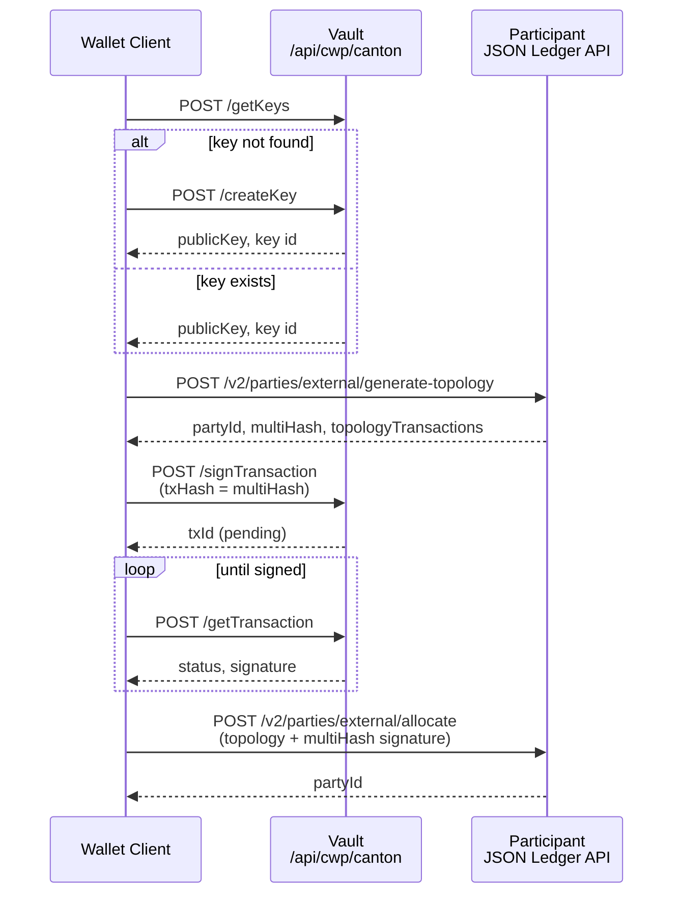

# Create a Canton external party

`canton-create-externalparty.ts` creates a Canton external party using Vault for key management and signing, and the participant JSON Ledger API for topology generation and allocation.

## Flow

1. `createKey` / `getKeys` (Vault)
2. `generate-topology` (participant)
3. `signTransaction` (Vault)
4. `allocate` (participant)



## Run

```bash
cp .env-example .env
npm install
npm run generate:canton-signing-sdk
npm run canton-create-externalparty
```
