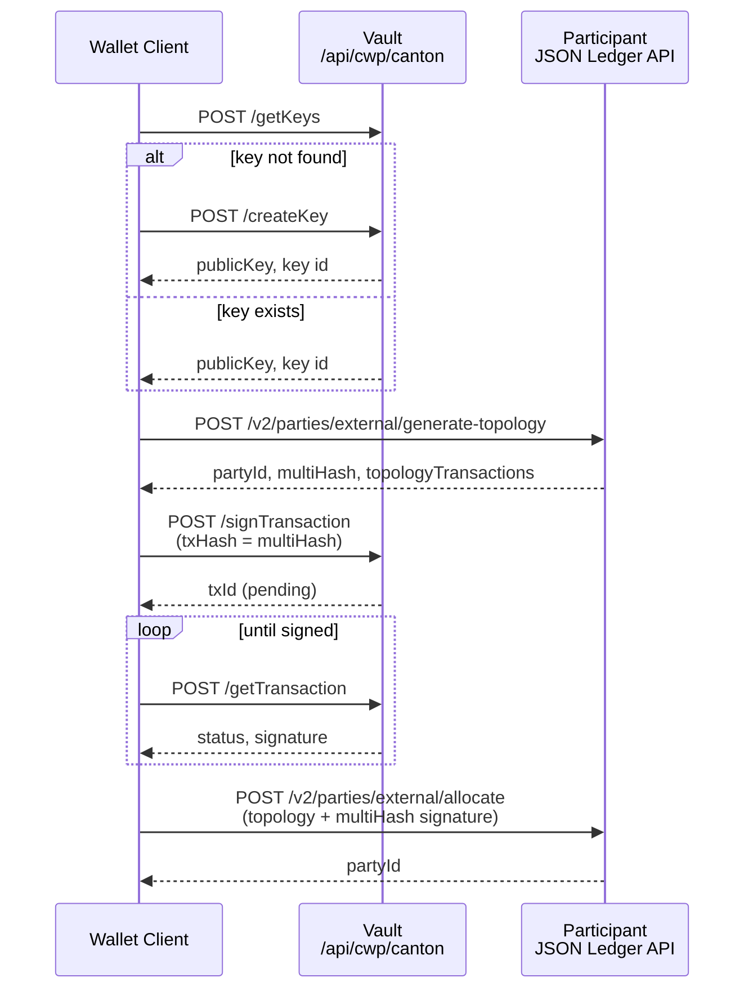

# Create a Canton external party

`canton-create-externalparty.ts` creates a Canton external party using Vault for Ed25519 key management and signing, and the participant JSON Ledger API for topology generation and allocation.

## Required environment variables

| Variable | Description |
|----------|-------------|
| `IV_API_BASE_URL` | Vault instance URL |
| `IV_API_KEY` | System user API key or Bearer JWT |
| `IV_INITIATOR_ID` | Vault user email (registered in Vault; used as Canton Signing `userIdentifier`) |
| `LEDGER_CLIENT_URL` | Participant JSON Ledger API base URL |
| `CANTON_AUTH_ISSUER` | Keycloak/OIDC issuer URL |
| `CANTON_AUTH_CLIENT_ID` | OAuth client ID |
| `CANTON_AUTH_CLIENT_SECRET` | OAuth client secret |

## Optional environment variables

| Variable | Default | Description |
|----------|---------|-------------|
| `MASTER_KEY` | `Default` | Vault master key name |
| `CANTON_CAIP2` | `canton:devnet` | Canton CAIP-2 chain identifier |
| `PARTY_HINT` | `ext-party-iv` | Canton party hint (appears in partyId) |
| `KEY_NAME` | derived from `PARTY_HINT` | Vault account/key name |
| `CANTON_AUTH_AUDIENCE` | `https://canton.network.global` | OAuth audience |
| `CANTON_AUTH_SCOPE` | `daml_ledger_api` | OAuth scope |

## Flow

1. `createKey` / `getKeys` (Vault Canton Signing API)
2. `generate-topology` (participant JSON Ledger API)
3. `signTransaction` (Vault - signs topology multiHash)
4. `allocate` (participant - registers party on-ledger)



## Run

```bash
cp .env-example .env   # fill in required values
npm install
npm run generate
npm run canton:create-externalparty
```

## Success criteria

- Key created or retrieved from Vault
- Topology generated with a `partyId` and `multiHash`
- Signing completes with status `signed`
- Party allocated on the participant with `grantUserRights: true`
