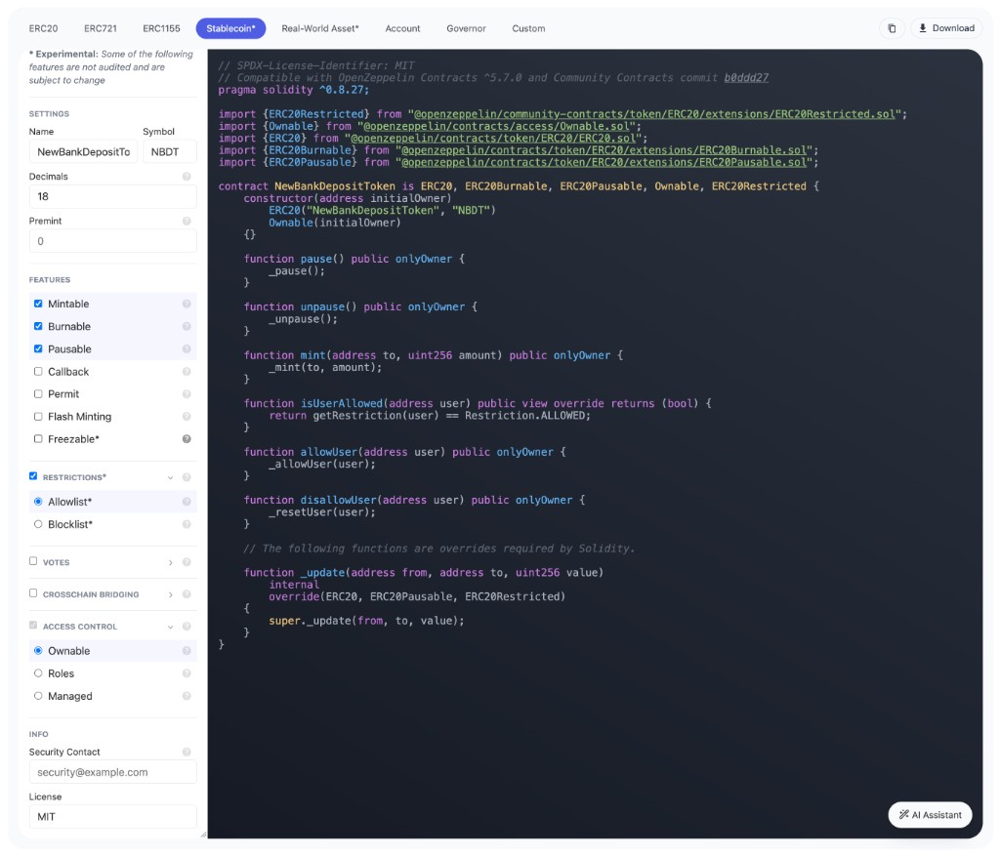

# EVM Deposit Token Deploy

Compile and deploy an ERC-7943 Deposit Token via CWP `makeTransaction` with `RawTransaction`. Vault performs MPC signing only - the client broadcasts the signed transaction through a local RPC node.

The Solidity contract starts from the [OpenZeppelin Contracts Wizard Stablecoin preset](https://wizard.openzeppelin.com/#stablecoin) and adds the `ERC20uRWA` [Community Contracts extension](https://docs.openzeppelin.com/community-contracts/api/token). This provides ERC-7943 account restrictions, recipient eligibility checks, frozen balances, and forced transfers.



The screenshot shows the wizard baseline at community-contracts commit `b0ddd27`. This repository pins a newer community-contracts revision because native `canReceive` is not present at that older commit.

## Required environment variables


| Variable            | Description                          |
| ------------------- | ------------------------------------ |
| `IV_API_BASE_URL`   | Vault instance URL                   |
| `IV_API_KEY`        | System user API key or Bearer JWT    |
| `IV_SOURCE_ADDRESS` | Vault-managed EVM address (deployer) |


## Optional environment variables


| Variable             | Default                                       | Description                                                                |
| -------------------- | --------------------------------------------- | -------------------------------------------------------------------------- |
| `IV_CAIP19`          | `eip155:11155111/slip44:60`                   | CAIP-19 chain identifier (Sepolia)                                         |
| `IV_EXPLORER_TX_URL` | `https://sepolia.etherscan.io/tx/`            | Block explorer base URL                                                    |
| `EVM_RPC_URL`        | `https://ethereum-sepolia-rpc.publicnode.com` | EVM JSON-RPC endpoint for gas estimation, broadcasting, and receipt lookup |
| `IV_INITIATOR_ID`    | (none)                                        | Vault user email for initiator tracking                                    |


## How it works

1. Compile `contracts/NewBankDepositToken.sol` at runtime with pinned OpenZeppelin dependencies
2. Encode `IV_SOURCE_ADDRESS` as the `initialOwner` constructor argument
3. Build an unsigned EIP-1559 deployment transaction using `viem`
4. Submit `RawTransaction` to CWP `makeTransaction` - Vault signs without broadcasting
5. Retrieve `Result.Transaction.SignedTransaction` from operation status
6. Broadcast signed bytes via `eth_sendRawTransaction`
7. Wait for the receipt and print the deployed contract address

The contract includes:

- Owner-controlled mint, pause, unpause, allow-list management, freezing, and enforcement
- ERC-7943 `canReceive`, `getFrozenTokens`, `setFrozenTokens`, and `forcedTransfer`
- ERC-20 burn support from the wizard baseline, although the admin menu intentionally uses ERC-7943 enforcement rather than `burnFrom`


## Policy posture

Requires a policy that allows `makeTransaction` from the source address. Deploy transactions have an empty destination address.

## Run

```bash
npm run evm:deploy
```

Copy the final `Contract address` value into `.env`:

```text
IV_TOKEN_CONTRACT_ADDRESS=0x...
```

Then run the [interactive Deposit Token admin menu](evm-deposit-token.md).

## Success criteria

- Operation reaches `SUCCEEDED` with `Result.Transaction.SignedTransaction` present
- Local `sendRawTransaction` succeeds and returns a transaction hash
- The receipt contains a contract address and the script prints the corresponding `IV_TOKEN_CONTRACT_ADDRESS`

